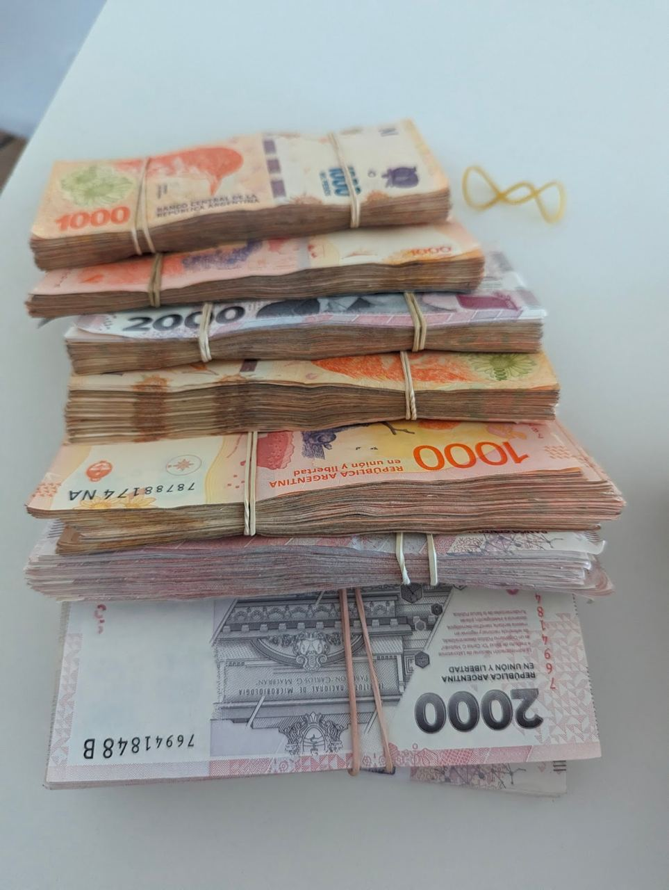
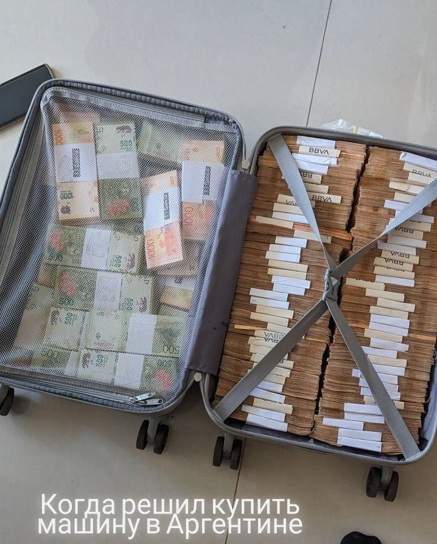

  
  

Довольно интересно жить в стране, валюта которой делает кульбиты круче рубля. В июне курс песо к доллару был ~480 песо за доллар. Сегодня уже более 1000 песо за доллар. x2 за 3 месяца.
Жалко только что цены тоже растут. (второе фото "из интернета")
