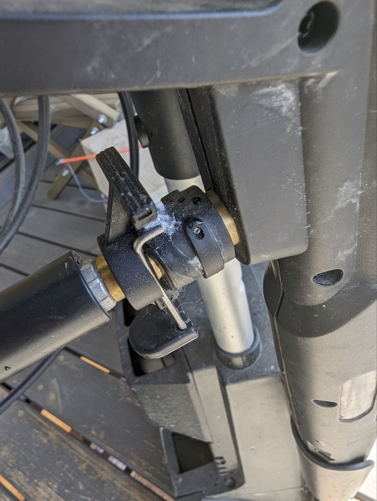

Половина всего DIY в мире держится на отсутствии нормального сервиса. (Как и пиратства игр, например).

Мойка elitech не пережила зиму - сломался узел крепления шланга в пистолет. Казалось бы - зайти на озон или Маркет и заказать новый пистолет. Но их там нету ©. Пришлось заклеить самому.

Теперь мойка работает, а производитель не продал запчасть. Ну производитель суперклея и соды в выигрыше 😂.
