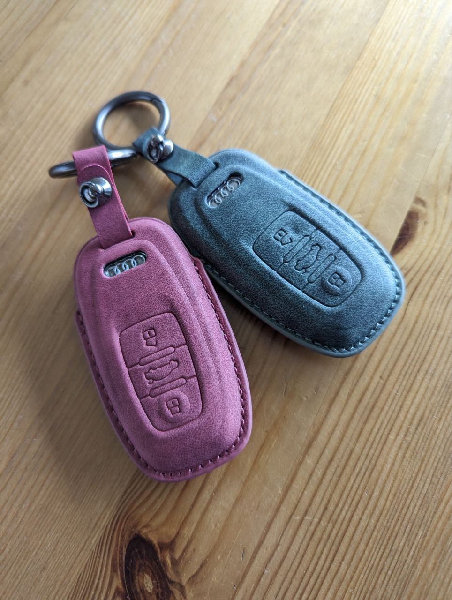

В машине есть память сидений и две настройки привязываются к двум ключам. Каким ключом открываешь, под такого водителя подстраивается сидение и зеркала.
Не удобно было только то, что ключи путаешь.
Теперь вот не перепутаем.
