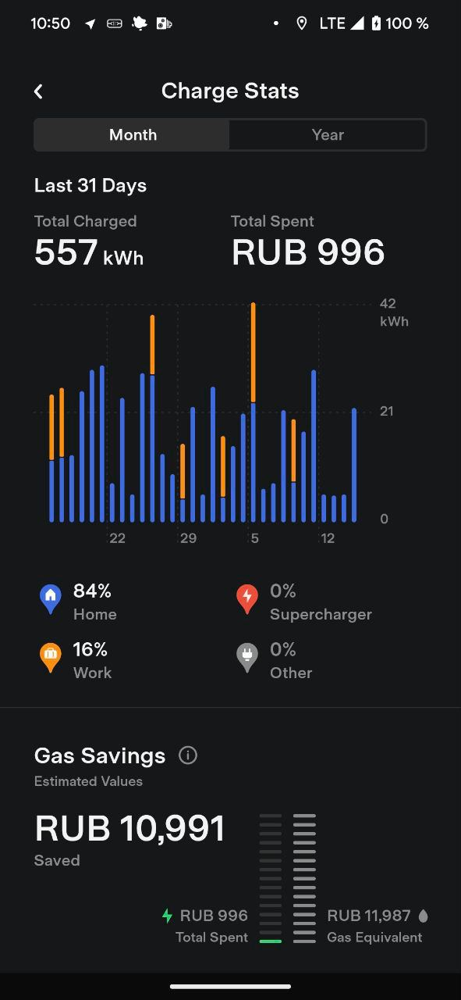
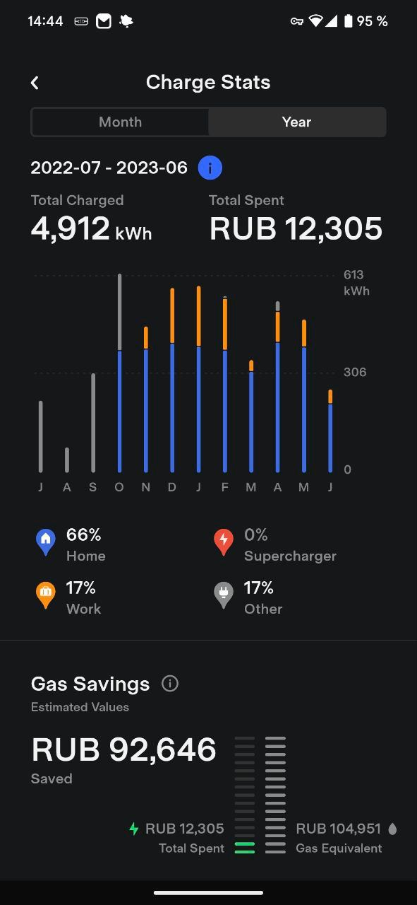

  
  

Про расход электричества на тесле. У меня получается примерно 1000км в месяц и 1000 рублей на электричество. График в приложении показывает сколько скушано kWh и сколько это стоило денег. В самом приложении есть дефолтные значения (даже для россии, что удивительно), но можно занести свои тарифы - и ночной/дневной, и цену на бензин указать, для сравнения и экономии. За год я проехал ~14000 километров. По факту даже меньше года, а месяцев 10.

В итоге получается экономия (*якобы*) ~100 тысяч рублей в год на бензине. Плюс ~50 тысяч в год на налоге, плюс сколько то на ТО и парковках. Но я мало паркуюсь на платных парковках, мне это не актуально.
