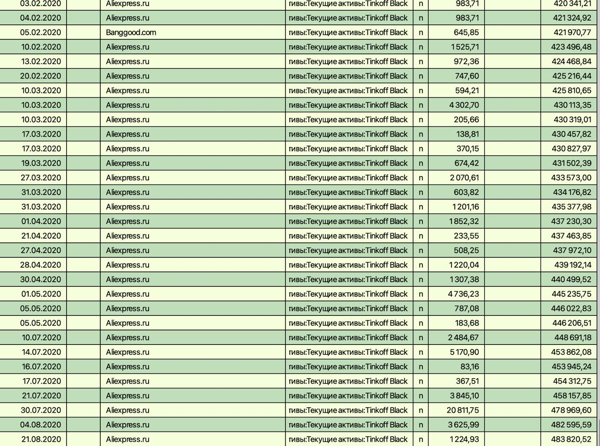

Есть у меня домашняя бухгалтерия в GnuCash (ну, была).
Я её вёл несколько лет — с 2014 по 2018. А в 2018 почему-то бросил. Наверное, из-за покупки дома: было очень много всяких трат наличными и вообще сложные движения средств туда-сюда. Например, как я снимал деньги, полученные от ВТБ в кредит.

Относительно недавно я взял выгрузку транзакций в Тинькофф за всё то время и импортировал их в GnuCash. Сижу теперь, разгребаю, что к чему относится.

Так вот, сколько у меня покупок на AliExpress, вы не представляете!
И это ещё некоторые вещи уходят в другие статьи расходов. Например, два телефона OnePlus по 500 долларов каждый, купленные на JD.ru, ушли в раздел «Телефоны».
