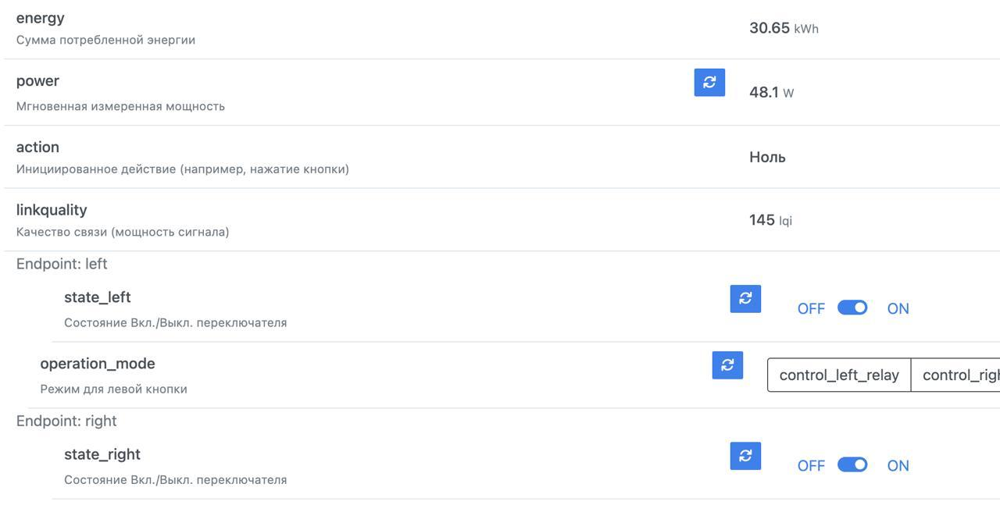

Выключатель Aqara, который управляет светом на террасе и тремя лампами на кухне, за всё время насчитал около 30 кВт⋅ч потребления. Учитывая, что ему уже примерно 7 лет — цифра неожиданно большая.

При этом все четыре лампы вместе потребляют всего около 48 Вт в моменте.

С одной стороны, немного. С другой — на дистанции даже такие мелочи превращаются в десятки киловатт-часов.
