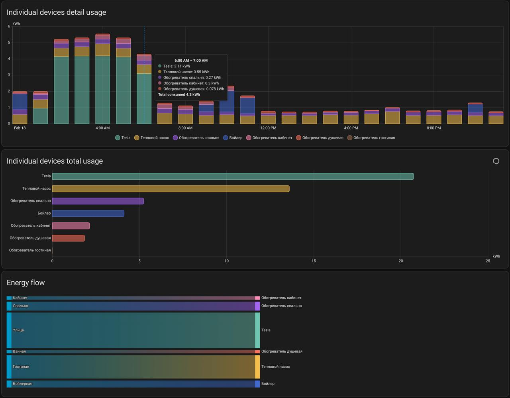

В обновлённом Home Assistant попробовал панель энергопотребления — оказалось очень наглядно. Можно задать источники энергии (например, подключить общий счётчик) и добавить измерения по отдельным устройствам. В итоге на одном графике видно, сколько энергии уходит на каждую конкретную нагрузку.
А если подключить ещё и основной счётчик, появляется еще «неучтённое» потребление. Это всё остальное: свет, плита, духовка, чайник, холодильник и прочие фоновые потребители, которые обычно остаются вне детализации. Это хороший стимул наконец поставить более-менее умный счётчик.
Проблема в том, что сейчас у меня на столбе висит счётчик от Россетей — НАРТИС-И300, и напрямую подключить его к Home Assistant нельзя. Поэтому остаётся два варианта: либо ставить дополнительный счётчик после него, уже со своей интеграцией, либо собирать решение на базе трёх PZEM-модулей и ESP32.
С PZEM вариант даже интереснее: помимо общего потребления будет доступна подробная статистика по каждой фазе — напряжение, ток, перекос фаз и прочие параметры сети.
Но в домашнем щитке почти нет свободного места, и пока не очень понятно, как всё это реализовать аккуратно и эстетично.
