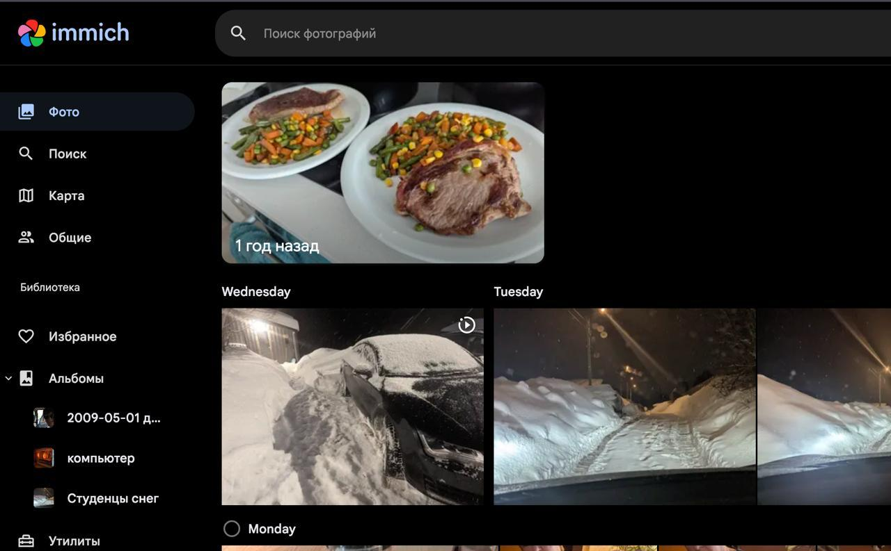

Попробовал Immich — по сути это self-hosted альтернатива Google Photos.

Ставится в Docker на свою виртуалку, выделяешь хранилище под фото и видео, настраиваешь внешний доступ с доменом и сертификатом — и всё, своя «облако-фотогалерея» готова.

Ребята явно вдохновлялись Google Фото: интерфейс и логика очень похожи. Есть альбомы, «воспоминания», распознавание лиц, шаринг альбомов или даже всей библиотеки с партнёром. Можно создавать отдельных пользователей. Есть мобильное приложение — автоматически синхронизирует фото и видео с телефона на сервер.

Миграция из Google тоже возможна, но не в один клик: сначала нужно выгрузить архив, а потом импортировать его в Immich через отдельную утилиту.

PS работает супер быстро, даже быстрее чем Яндекс.диск, хотя живет плюс-минус в тех же облаках.
